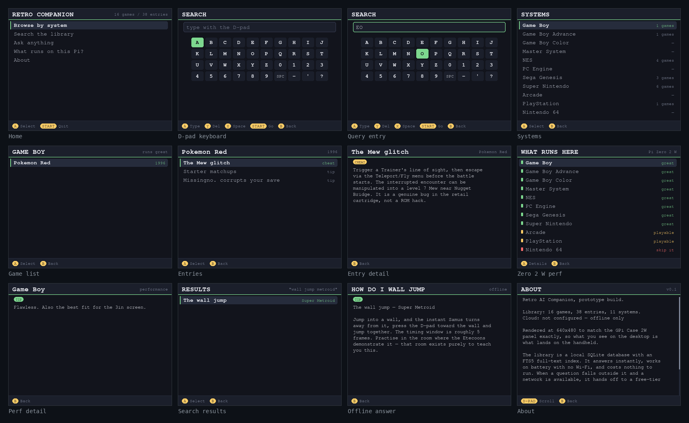

# Retro AI Companion

[](https://github.com/BrandonVidaurre/retro-ai-companion/actions/workflows/ci.yml)
[](https://www.python.org/)
[](LICENSE)

A controller-driven companion app for a RetroPie handheld, rendered at the
GPi Case 2W's exact panel resolution (640×480, 3.0" IPS).

It runs identically on a Windows desktop and on the Pi, so the whole thing can
be built and finished before the case arrives.



## Run it

```bash
pip install -r requirements.txt
python companion.py --scale 2      # desktop: 1280x960 window, easier to see
python companion.py                # on the Pi: native 640x480
```

The knowledge base builds itself on first run (`companion.db`, 92KB). It's a
cache, not state — delete it, or run `--reseed`, and it comes back.

## Controls

| Desktop key | Handheld button | Does |
|---|---|---|
| Arrows | D-pad | Navigate / scroll |
| `Z` | A | Select |
| `X` | B | Back |
| `A` | X | Space (in the keyboard) |
| `S` / Backspace | Y | Delete (in the keyboard) |
| Enter | START | Submit / quit from home |
| Esc | — | Quit |

## Why it's built this way

Three constraints drove every decision, and they're all consequences of the
hardware rather than preferences:

**No microphone.** The GPi Case 2W has a speaker and a 3.5mm jack, but its only
USB port is for firmware updates. So nothing here is voice-driven — every
interaction is D-pad and face buttons, including text entry, which is why there
is an on-screen keyboard.

**512MB of RAM, shared with EmulationStation.** A local language model is not
happening; even a 0.5B model at Q4 is ~350MB and would thrash against the
emulator. The "brain" is instead SQLite with an FTS5 full-text index — it
answers in single-digit milliseconds, costs nothing, and never needs a network.

**Wi-Fi is sometimes there and sometimes not.** A handheld that's useless on
battery in the car defeats the point. So the offline index is the primary path,
and the cloud is a strict enhancement that the app degrades out of cleanly.

## The brain

```
question ──► FTS5 index ──► hits? ──► answer (instant, offline, free)
                             │
                             └─ no hits + Wi-Fi ──► free-tier LLM ──► answer
                                        │
                                        └─ unreachable ──► best offline hit
```

Search narrows before it widens: it tries `AND` across all terms first, and only
falls back to `OR` if that returns nothing. Function words are stripped, and
system shorthand is folded into the index — which is why "does n64 work" finds
the Nintendo 64 performance note rather than noise.

Offline first means first: a solid local hit ends the question there, whether
or not a key is configured. Spending a second of radio on battery to re-answer
something the index resolved in 0.04ms is a bad trade, and it would make the
handheld behave differently depending on whether Wi-Fi happened to be up.

The cloud step is optional and off by default. To enable it, set one env var
before launching — both have free tiers that cover hobby usage:

```bash
export GROQ_API_KEY=...        # or
export GEMINI_API_KEY=...
```

`CloudProvider` is a two-method interface, so swapping in Bedrock later is a
small class, not a refactor.

## Adding content

Edit the `GAMES` list near the top of `companion.py` and re-run with `--reseed`.
Each game is `(system_slug, title, year, summary, [(kind, title, body), ...])`
where kind is `tip`, `cheat`, `controls`, `lore`, or `perf`.

The seeded library is 16 games / 38 entries across 11 systems — enough to
exercise the search properly. The per-system performance notes are real
measurements of what a Zero 2 W can actually drive.

## What's on the card

Homebrew and public-domain titles only. This repository contains no ROMs and no
BIOS files and links to none — the companion ships authored *text about* games,
not the games. Emulation itself is settled law (*Sony v. Connectix*, *Sony v.
Bleem*, both 2000); redistributing the software that runs on it is not, and the
two are worth keeping separate.

## Moving it to the Pi

The GPi's buttons present as a standard SDL joystick under RetroPie, which is
why input funnels through one logical button vocabulary that both the keyboard
and the gamepad feed. Verify the button ordering on real hardware with `jstest`
and adjust `PADMAP` — RetroPie's GPi driver ordering has shifted between
releases.

Once the case is in hand, the remaining work is wiring it to launch on a button
combo from EmulationStation and running it as a systemd service.

## Development

```bash
pip install -r requirements-dev.txt

pytest -q                                   # 17 tests, no display needed
python companion.py --reseed                # rebuild the knowledge base
python companion.py --shots out/            # render every screen to PNG
python tools/contact_sheet.py out/ screens.png
```

`--shots` runs under SDL's dummy video driver, so it works over SSH with no
display attached — useful for checking layout on the Pi before the screen
exists. CI runs the same two commands on every push and uploads the rendered
screens as build artifacts, which is how a layout regression gets caught
without anyone plugging in a monitor.

The tests cover retrieval rather than rendering, because that is where a
regression is invisible: a broken index still draws a perfectly good menu with
nothing behind it. They pin the alias fold (`n64` → Nintendo 64), the AND→OR
narrowing order, hostile FTS5 input, the offline/cloud handoff in both
directions, and the stale-database rebuild. One of them asserts that a local
hit makes zero network calls — that's the design claim, so it's the one worth
failing a build over.

## Layout

```
companion.py              the whole app — screens, input, brain, seed data
test_companion.py         retrieval + fallback tests
tools/contact_sheet.py    builds screens.png from --shots output
.github/workflows/ci.yml  tests on 3.11 and 3.12, renders screens headless
```
